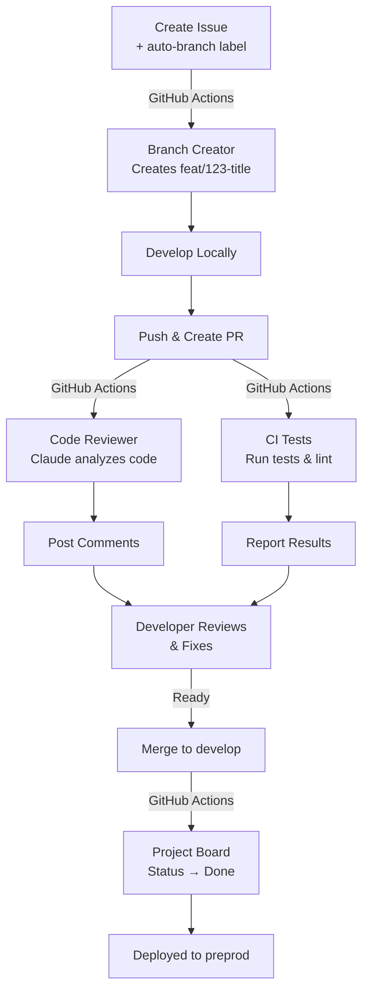

# Project LLM Management

Welcome to the **GitHub-based Project Management with LLM Agents** template!

This is a comprehensive, production-ready template for managing software projects using:

- 🏗️ **GitHub Projects v2** for centralized tracking
- 🤖 **LLM Agents** (Claude, ChatGPT, Gemini) for automation
- 🔄 **GitHub Actions** for CI/CD and workflows
- 👥 **Human oversight** via a central Project Board

## 🎯 Key Features

### Automated Workflows
- **Branch Creator**: Automatically creates feature branches when issues receive the `auto-branch` label
- **Code Reviewer**: AI-powered code reviews on pull requests
- **Test Feedback**: Automated testing, linting, and coverage reporting

### Project Management
- **Backlog View**: All future work, sorted by priority
- **Priority Board**: Kanban-style tracking by status
- **Team Items**: Personalized view filtered by owner

### Integration
- Seamless GitHub Projects v2 integration
- Multiple LLM provider support (Anthropic Claude, OpenAI, Google Gemini)
- Full CI/CD pipeline with automatic status updates

## 🚀 Quick Start

### 1. Prerequisites
- Git
- GitHub account with admin access
- GitHub CLI (`gh`)
- Python 3.11+ (if using Python workflows)

### 2. Clone/Fork this template
```bash
git clone https://github.com/your-org/project-llm-management.git
cd project-llm-management
```

### 3. Configure GitHub Secrets
Go to **Settings → Secrets and variables → Actions** and add:
- `CLAUDE_API_KEY` (for code review)
- `GH_TOKEN` (GitHub token with repo access)

### 4. Enable GitHub Projects v2
- Navigate to your repository's **Projects** tab
- Click **New project** and select **Table** or **Board**
- Workflows will sync project updates automatically

### 5. Create your first issue
- Use one of the provided templates (Feature, Bug, Task)
- Add the `auto-branch` label
- A branch will be created automatically!

## 📚 Documentation Structure

- **[Getting Started](./getting-started/installation.md)**: Setup and first steps
- **[Architecture](./architecture/overview.md)**: System design and components
- **[Guides](./guides/setup-github-projects.md)**: How to use each feature
- **[Agents](./agents/branch-creator.md)**: LLM agent documentation

## 🤖 How It Works



## 📊 Project Tracking

All work is tracked in **GitHub Projects v2** with three main views:

### Backlog
All future issues, sortable by priority and effort

### Priority Board
Current work in Kanban format:
- **Backlog**: Not started
- **In Progress**: Being worked on
- **In QA**: Testing/Review
- **Done**: Completed

### Team Items
Filter by assignee and sprint for personal tracking

## 🔐 Security

### Permissions Model
- **Branch Creator**: Write access (create branches)
- **Code Reviewer**: Read access (no modifications)
- **Test Feedback**: Read access (comment only)
- **Human maintainers**: Full permissions

### API Keys
All sensitive credentials stored in GitHub Secrets (never in git):
```
GH_TOKEN, CLAUDE_API_KEY, OPENAI_API_KEY, GEMINI_API_KEY
```

## 🎓 Use Cases

### ✅ Perfect For
- Distributed teams with async workflows
- Projects with many contributors
- Continuous learning environments
- DevOps-focused teams
- Open-source projects

### ⚠️ Consider Alternatives For
- Real-time synchronous work
- Projects requiring manual QA
- Systems without GitHub

## 🤝 Contributing

See [CONTRIBUTING.md](../CONTRIBUTING.md) for guidelines on how to contribute to this template.

## 📞 Support

- 📖 **Documentation**: See [Getting Started](./getting-started/installation.md)
- 💬 **Discussions**: GitHub Discussions tab
- 🐛 **Issues**: Use the provided issue templates
- 📧 **Email**: your-email@example.com

## 📄 License

MIT License - See [LICENSE](../LICENSE) file for details.

---

**Ready to get started?** → [Installation Guide](./getting-started/installation.md)

**Want to learn more?** → [Architecture Overview](./architecture/overview.md)

**Have questions?** → [FAQ](./faq.md)
