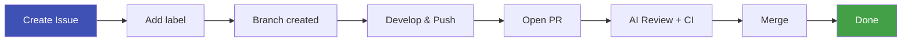

---
hide:
  - navigation
  - toc
---

<style>
.md-typeset h1 {
  font-size: 2.5em;
  font-weight: 700;
  margin-bottom: 0;
}
.hero-subtitle {
  font-size: 1.3em;
  color: var(--md-default-fg-color--light);
  margin-top: 0.5em;
  margin-bottom: 1.5em;
}
.stats-row {
  display: flex;
  justify-content: center;
  gap: 3em;
  margin: 2em 0;
  flex-wrap: wrap;
}
.stat-item {
  text-align: center;
}
.stat-number {
  font-size: 2.2em;
  font-weight: 700;
  color: var(--md-primary-fg-color);
  display: block;
  line-height: 1.2;
}
.stat-label {
  font-size: 0.85em;
  color: var(--md-default-fg-color--light);
  text-transform: uppercase;
  letter-spacing: 0.05em;
}
.cta-row {
  display: flex;
  justify-content: center;
  gap: 1em;
  margin: 2em 0;
  flex-wrap: wrap;
}
.install-box {
  background: var(--md-code-bg-color);
  border: 1px solid var(--md-default-fg-color--lightest);
  border-radius: 8px;
  padding: 1.5em 2em;
  max-width: 700px;
  margin: 2em auto;
  text-align: center;
}
.install-box code {
  font-size: 0.95em;
}
.section-divider {
  border: none;
  border-top: 1px solid var(--md-default-fg-color--lightest);
  margin: 3em 0;
}
</style>

# Automated GitHub Project Management

<p class="hero-subtitle">
You vibe your code with AI? This template organizes everything else.<br>
Issues, Kanban board, code reviews, branches — all automated. Zero config.
</p>

<div class="stats-row">
  <div class="stat-item">
    <span class="stat-number">8</span>
    <span class="stat-label">Automated Workflows</span>
  </div>
  <div class="stat-item">
    <span class="stat-number">1</span>
    <span class="stat-label">Install Command</span>
  </div>
  <div class="stat-item">
    <span class="stat-number">70%</span>
    <span class="stat-label">Tasks Automated</span>
  </div>
  <div class="stat-item">
    <span class="stat-number">0</span>
    <span class="stat-label">Config Required</span>
  </div>
</div>

<div class="cta-row">
  <a href="Getting-Started/" class="md-button md-button--primary">Get Started</a>
  <a href="https://github.com/dyvan/github-project-llm-management" class="md-button">View on GitHub</a>
</div>

<hr class="section-divider">

## Install in one command

<div class="install-box">

```bash
curl -fsSL https://raw.githubusercontent.com/dyvan/github-project-llm-management/main/install.sh | bash
```

</div>

The setup wizard asks for your **GitHub token** and optional **Gemini API key**. Labels, project board, and workflows are configured automatically.

<hr class="section-divider">

## What you get

<div class="grid cards" markdown>

-   :material-view-dashboard:{ .lg .middle } **Auto Project Board**

    ---

    Issues and PRs are automatically added to your Kanban board. Status flows from Backlog to Done without manual updates.

-   :material-source-branch:{ .lg .middle } **Automatic Branches**

    ---

    Add the `auto-branch` label to any issue. A branch `feat/123-title` is created and linked in seconds.

-   :material-file-document-edit:{ .lg .middle } **Specification Questionnaire**

    ---

    Gemini generates a tailored questionnaire to clarify requirements before implementation starts.

-   :material-robot:{ .lg .middle } **AI Code Review**

    ---

    Every PR is analyzed by Gemini AI with improvement suggestions, bug detection, and security checks.

-   :material-test-tube:{ .lg .middle } **Automated Testing**

    ---

    Lint, tests, and build run on every PR. Results are posted as comments. No CI setup needed.

-   :material-check-all:{ .lg .middle } **Auto-close Features**

    ---

    Parent issues close automatically when all sub-issues are done. No manual tracking required.

</div>

<hr class="section-divider">

## Manual work vs. this template

| Task | Without template | With template |
|---|---|---|
| Create a branch | Manual `git checkout -b` | Add label `auto-branch` |
| Track issue status | Drag cards on the board | Automatic: Backlog → In Review → Done |
| Code review | Wait for humans | Gemini reviews in seconds + human review |
| Clarify requirements | Meetings, back-and-forth | Gemini generates a spec questionnaire |
| Close parent issues | Remember to check manually | Auto-closes when sub-issues are done |
| CI/CD setup | Write workflow YAML | Pre-configured, works out of the box |

<hr class="section-divider">

## How it works


```mermaid
graph LR
    A["Create Issue"] --> B["Add label"]
    B --> C["Branch created"]
    C --> D["Develop & Push"]
    D --> E["Open PR"]
    E --> F["AI Review + CI"]
    F --> G["Merge"]
    G --> H["Done"]
    style A fill:#4051b5,color:#fff
    style H fill:#43a047,color:#fff
```

**You handle steps 1 through 5.** Everything after that is automated.

<hr class="section-divider">

## Get started in 3 steps

### 1. Install the template

```bash
curl -fsSL https://raw.githubusercontent.com/dyvan/github-project-llm-management/main/install.sh | bash
```

### 2. Create your first issue

```bash
gh issue create --title "Add user authentication" --label "type:feature"
gh issue edit 1 --add-label "auto-branch"
```

A branch is created automatically. Check it out and start coding.

### 3. Open a PR and let automation take over

```bash
gh pr create --title "feat: Add user auth (#1)" --body "Closes #1"
```

Gemini reviews your code. CI runs tests. Merge it — the issue closes and the board updates.

<hr class="section-divider">

## Built for AI-assisted development

Works with **Claude Code**, **Cursor**, **GitHub Copilot**, **Windsurf**, or plain `vim`. This template handles project management so you focus on shipping code.

<div class="stats-row">
  <div class="stat-item">
    <span class="stat-number">:material-language-python:</span>
    <span class="stat-label">Python 3.11+</span>
  </div>
  <div class="stat-item">
    <span class="stat-number">:octicons-mark-github-16:</span>
    <span class="stat-label">GitHub Actions</span>
  </div>
  <div class="stat-item">
    <span class="stat-number">:material-robot:</span>
    <span class="stat-label">Google Gemini</span>
  </div>
  <div class="stat-item">
    <span class="stat-number">:material-book-open-variant:</span>
    <span class="stat-label">MkDocs Material</span>
  </div>
</div>

<hr class="section-divider">

## FAQ

??? question "Do I need a Gemini API key?"
    It's optional. Without it, you still get automatic branches, project board sync, CI tests, and auto-close. The Gemini key enables AI code review and specification questionnaires.

??? question "Can I use this with an existing repo?"
    Yes. The install script clones the template into a new project, but you can also copy the workflows and scripts into an existing repo manually.

??? question "Is this only for Python projects?"
    No. The template works with any language. The Python scripts are for the automation layer (project sync, QCM generation). Your project code can be anything.

??? question "What GitHub token scopes do I need?"
    The token needs `repo`, `project`, and `workflow` scopes. The setup wizard will tell you exactly what to configure.

<hr class="section-divider">

<div style="text-align: center; margin: 2em 0;">
  <a href="Getting-Started/" class="md-button md-button--primary" style="margin: 0.5em;">Get Started</a>
  <a href="https://github.com/dyvan/github-project-llm-management" class="md-button" style="margin: 0.5em;">Star on GitHub</a>
</div>
